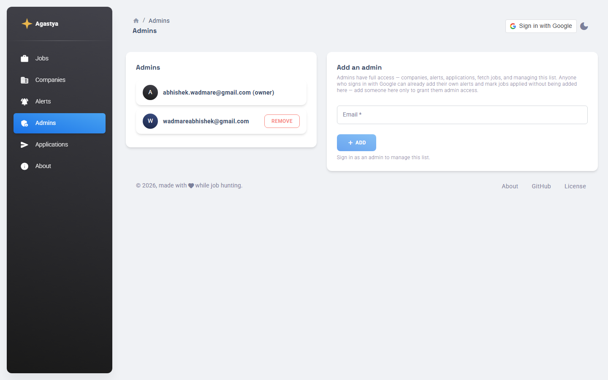
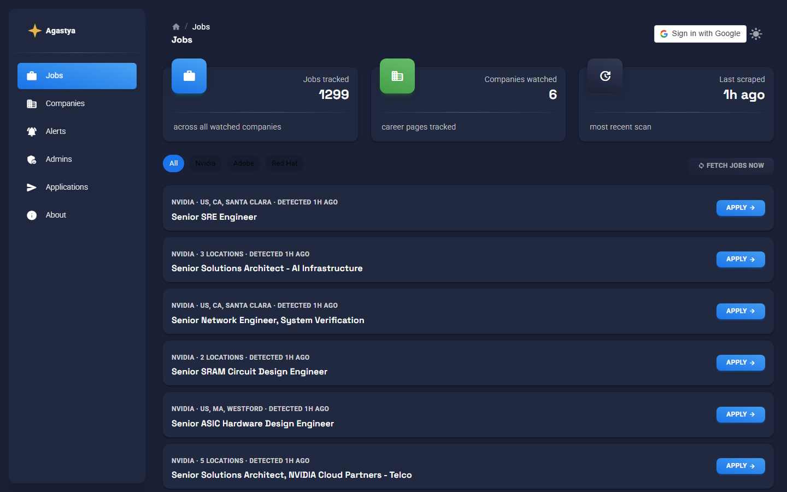
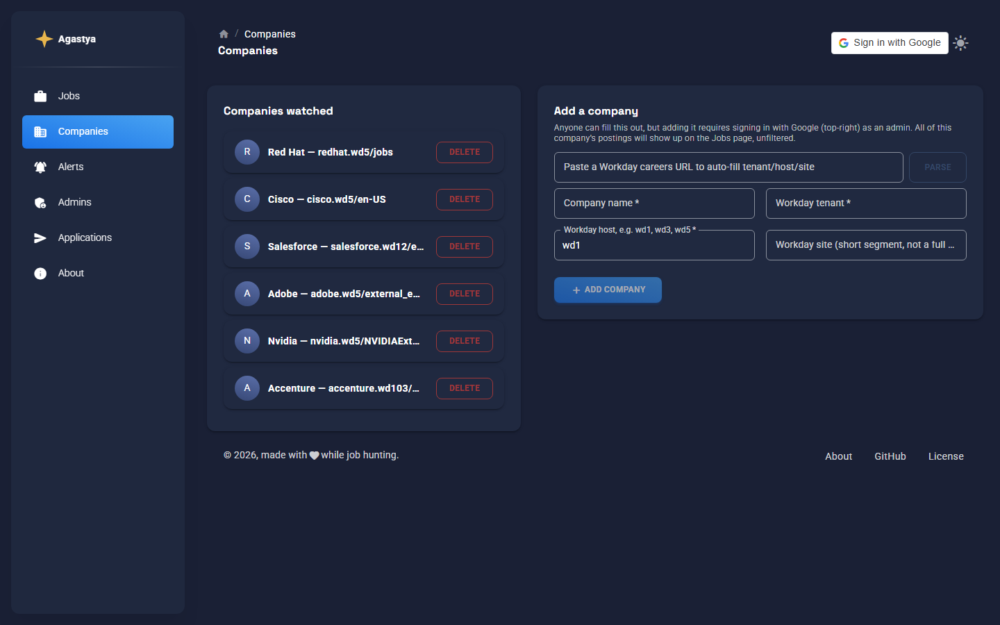

# Agastya

A self-hosted job alert system that monitors Workday-hosted company career
pages directly (rather than waiting for LinkedIn/Indeed syndication),
surfaces new postings on a public multi-page dashboard (Jobs / Companies /
Alerts / Admins / Applications / About), and sends desktop + Telegram
notifications.
Anyone can view the Jobs/Companies dashboard, and any Google account can
sign in to add its own alerts and mark jobs applied - those are private
to whoever added them, not a shared public list. Managing companies,
triggering/syncing scrapes, and granting others that same access all
require being an admin - enforced server-side, not just in the browser.
A built-in **Admins** page lets the bootstrap owner grant others full
admin access.

## Screenshots

| Jobs | Companies |
|---|---|
|  |  |

| Alerts | Applications |
|---|---|
|  |  |

| Admins | About |
|---|---|
|  |  |

A dark mode toggle (top-right of the navbar) is also available:

| Jobs (dark) | Companies (dark) |
|---|---|
|  |  |

## Architecture

```
scraper/   Python. Polls every company's public Workday JSON API
           (paginated - fetches everything, not just the first page),
           fetching the current company/job lists from the Worker
           (GET /api/companies, GET /api/jobs - R2-backed, not local
           files) and POSTing newly found postings to
           POST /api/scraper/sync-jobs, authenticated with a shared
           secret since GitHub Actions can't do an interactive Google
           sign-in. No git commit, no Pages rebuild needed - the
           frontend reads jobs/companies from the Worker at runtime.
           Runs via GitHub Actions cron (currently paused) or on demand
           via the Jobs page's "Fetch jobs now" button.

frontend/  React (Vite) + Material Dashboard React (MUI-based, Creative
           Tim), deployed to GitHub Pages. Multi-page - Jobs, Companies,
           Alerts, Admins, Applications, About - via HashRouter (no
           server-side routing needed on static hosting). Jobs/Companies/
           Alerts/Applications are all fetched live from the Worker;
           only Admins still fetches a static `admins.json`. The
           Companies, Alerts, and Admins pages have "Sign in with
           Google" admin controls - but the frontend itself never
           decides who's allowed to write anything; it just calls the
           Worker and shows the result (admin-only UI hiding is
           cosmetic only).

worker/    A Cloudflare Worker. Verifies the Google ID token it receives.
           Any verified sign-in can add its own alerts and mark jobs
           applied - no approval needed. Everything else (companies,
           fetch/sync jobs, managing the admin list) requires the email
           to be an admin - either the permanent bootstrap owner
           (ALLOWED_EMAIL) or an entry in admins.json (a flat list, no
           roles). jobs.json/companies.json/alerts.json/applications.json
           all live in an R2 bucket bound to the Worker. jobs/companies
           are public, no auth (GET /api/jobs, GET /api/companies).
           alerts/applications are private - GET /api/alerts and
           GET /api/applications return only entries you own (or every
           entry, if you're an admin), and nothing at all if you're not
           signed in. admins.json is the one file left on the GitHub
           repo, written using a GitHub token stored as a Worker secret
           (that same token also dispatches the scraper workflow via the
           GitHub Actions API for "Fetch jobs now"). This is the actual
           security boundary. Deleting an alert also requires owning it,
           unless you're an admin. POST /api/scraper/sync-jobs is a
           separate route the scraper itself uses, authenticated by a
           shared secret instead of a Google token.

admin/     A local-only CLI, kept as an offline fallback - though as of
           the R2 migration above, none of its commands work anymore
           (they all expect local copies of files that live only in R2
           now); it prints a clear error pointing at the web UI instead
           of doing anything. Uses a hashed password in a git-ignored
           token.txt.
```

Nothing sensitive - no GitHub token, no password - is ever present in the
deployed frontend bundle. The Google client ID and Worker URL in
`frontend/src/config.js` are meant to be public.

**Companies vs. Alerts:** `companies.json` (which Workday career pages to
watch) is what actually drives the scraper. `alerts.json` is fully
functional to add/edit/delete, and each entry is now private to whoever
added it - but nothing filters *jobs* by an alert's keywords yet, that's
reserved for a future feature. Every posting from a watched company
shows up on Jobs today for everyone, unfiltered, regardless of anyone's
alerts.

**Known quirks worth knowing before you debug them:**
- GitHub Actions has a built-in loop-prevention rule: a commit pushed
  using a workflow's own auto-generated token does not trigger other
  workflows, even if their `on.push.paths` would otherwise match. This
  used to bite `scrape.yml`'s job-listing commit before jobs.json moved
  to R2 - now that `scrape.yml` doesn't commit anything, this doesn't
  apply here, but worth knowing if you add a workflow that commits data
  and expects Pages to pick it up automatically.
- The Google Identity Services script loads `async`/`defer`, so it may
  not be ready the instant a page mounts. The sign-in button polls for
  it (100ms interval, 10s timeout) rather than checking once, so it
  should always eventually appear - if it doesn't within ~10s, the
  script itself failed to load (network block, ad blocker, etc).

## 1. Google OAuth client (for Sign-In)

1. Go to [Google Cloud Console](https://console.cloud.google.com/) →
   APIs & Services → Credentials.
2. Create an OAuth 2.0 Client ID, type "Web application".
3. Under **Authorized JavaScript origins**, add your GitHub Pages URL,
   e.g. `https://<your-username>.github.io`.
4. Copy the client ID - you'll need it in two places (step 4 and step 6).

## 2. GitHub repo + a scoped token for the Worker

1. Push this project to a new GitHub repo.
2. Create a **fine-grained personal access token**
   (Settings → Developer settings → Fine-grained tokens) scoped to just
   this repo, with **Contents: read and write** (only `admins.json` is
   git-backed now - everything else moved to R2) AND **Actions: read
   and write** permissions. The second one is easy to miss but required
   - without it, the Jobs page's "Fetch jobs now" button will fail with
   a permissions error.

## 3. Deploy the Cloudflare Worker

```bash
cd worker
npm install
npx wrangler login
```

R2 needs to be enabled once per Cloudflare account before you can create
a bucket - **dashboard.cloudflare.com → R2 Object Storage → Enable R2**
(free tier is generous; this JSON-blob use case won't come close to the
limits, but Cloudflare requires the explicit opt-in regardless). Then:

```bash
npx wrangler r2 bucket create agastya-data
```

Edit `worker/wrangler.toml`:
- `ALLOWED_EMAIL` - the permanent bootstrap admin, e.g. your own email.
  This account is always an admin, even if `admins.json` is missing or
  empty, so you can't lock yourself out.
- `GOOGLE_CLIENT_ID` - paste the client ID from step 1
- `GITHUB_OWNER` - your GitHub username
- `GITHUB_REPO` - your repo name
- `[[r2_buckets]]` - already set to `bucket_name = "agastya-data"`; change
  it if you named your bucket something else

Then:

```bash
npx wrangler secret put GITHUB_TOKEN
# paste the fine-grained PAT from step 2 when prompted

npx wrangler secret put SCRAPER_API_KEY
# paste a random string, e.g. output of `openssl rand -hex 32` - the
# scraper uses this to authenticate POST /api/scraper/sync-jobs since it
# can't do an interactive Google sign-in. Add the SAME value as a GitHub
# Actions secret too (Settings > Secrets and variables > Actions), same
# name, so scrape.yml can use it.

npm run deploy
```

Wrangler will print your Worker's URL, something like
`https://agastya-admin.<your-subdomain>.workers.dev`.

All four files (`jobs.json`, `companies.json`, `alerts.json`,
`applications.json`) start out empty in the new bucket automatically -
the Worker falls back to an empty list for any of them that don't exist
yet, both on read and on the first write, so no seeding is required for
a fresh setup. If you're migrating from an existing git-tracked set of
these files instead, seed them from your actual data so you don't lose
anything:
```bash
npx wrangler r2 object put agastya-data/jobs.json --file=path/to/jobs.json --content-type=application/json
npx wrangler r2 object put agastya-data/companies.json --file=path/to/companies.json --content-type=application/json
npx wrangler r2 object put agastya-data/alerts.json --file=path/to/alerts.json --content-type=application/json
npx wrangler r2 object put agastya-data/applications.json --file=path/to/applications.json --content-type=application/json
```

## 4. Point the frontend at your Worker and Google client

Edit `frontend/src/config.js`:

```js
export const GOOGLE_CLIENT_ID = "<paste from step 1>";
export const WORKER_BASE_URL = "<paste your Worker URL from step 3>";
```

Also update the two hardcoded GitHub links in
`frontend/src/layouts/about/index.jsx` (repo and profile URLs) if
you're forking this rather than running it as-is.

Commit and push - this triggers `deploy.yml`, which builds and publishes
to GitHub Pages.

## 5. Enable GitHub Pages

**Settings → Pages → Build and deployment → Source: GitHub Actions.**

## 6. Find your target companies' Workday details

Not every company uses Workday - check by visiting their careers page. If
the URL looks like `https://<tenant>.wd1.myworkdayjobs.com/<site>/...`,
you're good. Note the `wd1` part - it's sometimes `wd3`, `wd5`, etc; the
Companies page's "paste a Workday URL" parser fills this in for you
automatically, so you shouldn't need to edit code for this.

## 7. Add your first company

Once deployed, visit your live site's **Companies** page. Anyone can see
the watched companies and fill out the add-company form, but submitting
requires clicking **Sign in with Google** (top-right) and signing in as
an admin - adding a company is admin-only, unlike alerts, which any
signed-in Google account can add. Once added, every posting from that
company shows up on the Jobs page -
unfiltered, no keyword/location matching yet (that's a deferred
per-viewer feature; the **Alerts** page still works if you want to use
it, it's just not wired into the scraper).

## 8. (Optional) Telegram notifications

1. Message [@BotFather](https://t.me/BotFather) on Telegram, run `/newbot`,
   copy the token it gives you.
2. Message [@userinfobot](https://t.me/userinfobot) to get your numeric
   chat ID.
3. In your repo: **Settings → Secrets and variables → Actions**, add:
   - `TELEGRAM_BOT_TOKEN`
   - `TELEGRAM_CHAT_ID`

## 9. Run the scraper

Either click **Fetch jobs now** on the live site's Jobs page (signed in
as an admin), or trigger it manually from GitHub: **Actions tab
→ Scrape jobs → Run workflow**. Both dispatch the same workflow. The
cron schedule is currently commented out in
`.github/workflows/scrape.yml` - uncomment it (and adjust the interval)
if you want it to run automatically again.

## Managing admins

Any Google account can sign in and add its own alerts or mark a job
applied - no approval needed. Beyond that base access, the permanent
bootstrap admin (`ALLOWED_EMAIL` in `worker/wrangler.toml`) can grant
others full admin access from the **Admins** page - visible to everyone,
but the add/remove controls only work when signed in as an existing
admin. Admins can manage companies, fetch/sync jobs, and the admin list
itself, in addition to everything a plain signed-in account can already
do.

The list lives in `frontend/public/data/admins.json` (just a flat list
of emails, no roles), written through the Worker the same way as the
other data files (a git-tracked, auditable commit per change). There's
no "edit" action - remove and re-add if needed.

## Offline / local admin fallback

`admin/admin_cli.py` no longer works, for any of its three commands
(`add-alert`, `delete-alert`, `mark-applied`) - they all depended on
local copies of `alerts.json`/`jobs.json`/`applications.json`, which
moved to R2 (issue #7) and are now only reachable through the Worker.
This offline tool was deliberately left as-is rather than repointed at
the Worker/R2 (low-stakes fallback, not worth the added complexity) -
each command now prints a clear error and exits instead of silently
diverging from the live site. Use the web UI instead.

## Local job watcher (desktop + Telegram notifications)

Runs continuously on your own machine instead of waiting on the 4-hour
GitHub Actions cron. Polls the same Workday endpoints on a configurable
interval (default 30 min, minimum 20), fires a desktop popup and/or
Telegram message for new postings, and writes results to a local JSON
file (default your Downloads folder) - it never commits anything back
to the repo.

The watched-company list and the initial "already seen" baseline are
always fetched fresh from the live repo on GitHub, so this stays in
sync with whatever you've configured on the Companies page without
needing a `git pull`.

```bash
cd scraper
pip install -r requirements.txt -r requirements-local.txt
cp .env.example .env   # edit as needed - interval, output path, Telegram creds
python local_watch.py
```

Leave it running in a terminal; stop with Ctrl+C.

To bring what the watcher finds into the live site, go to the **Alerts**
page (signed in) and use **Sync jobs from local watcher** to upload the
local file - it merges by job id via the Worker, so re-uploading the
same file is always safe.

## Local development

```bash
cd frontend
npm install
npm run dev
```

## Notes on scope

This deliberately does not scrape LinkedIn. LinkedIn's Terms of Service
prohibit automated scraping, and detection risks account suspension.
Workday's job search endpoint is a public, unauthenticated JSON API
designed to be consumed by the career site's own frontend, which is a
materially different situation.

## License

MIT - see [LICENSE](./LICENSE).
