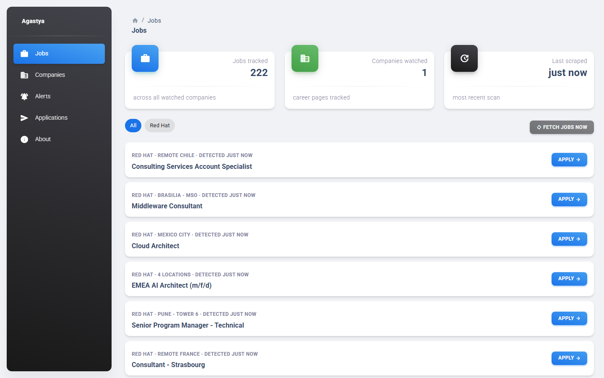
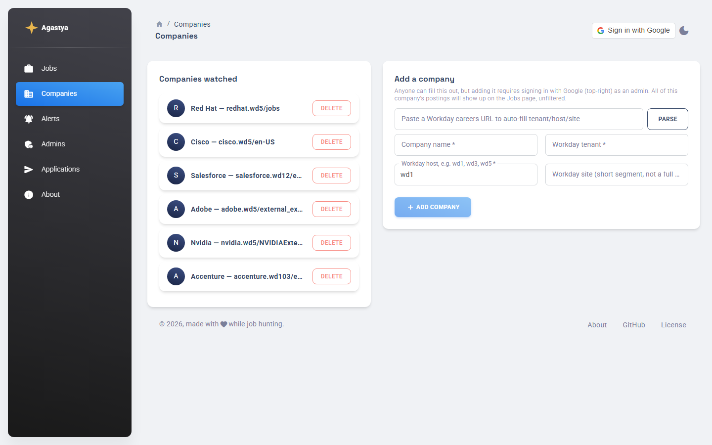
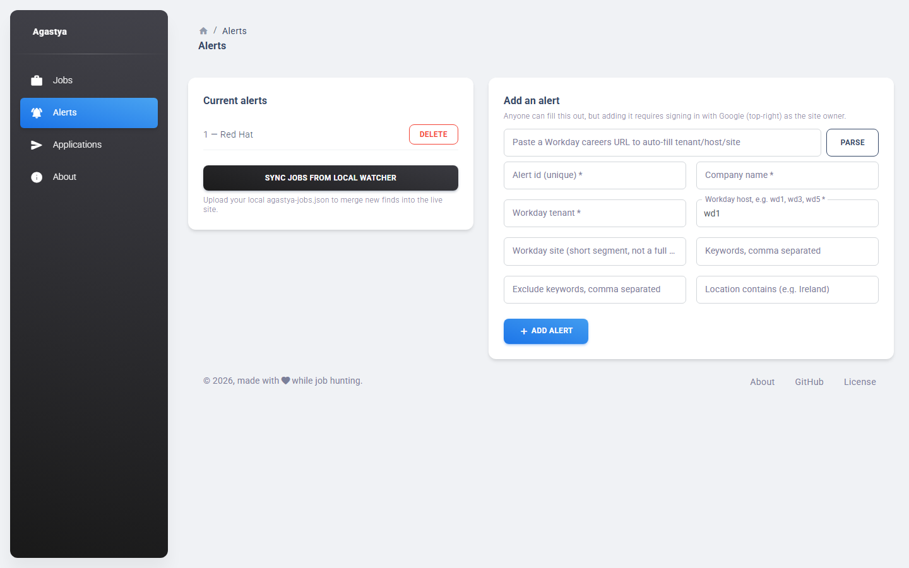
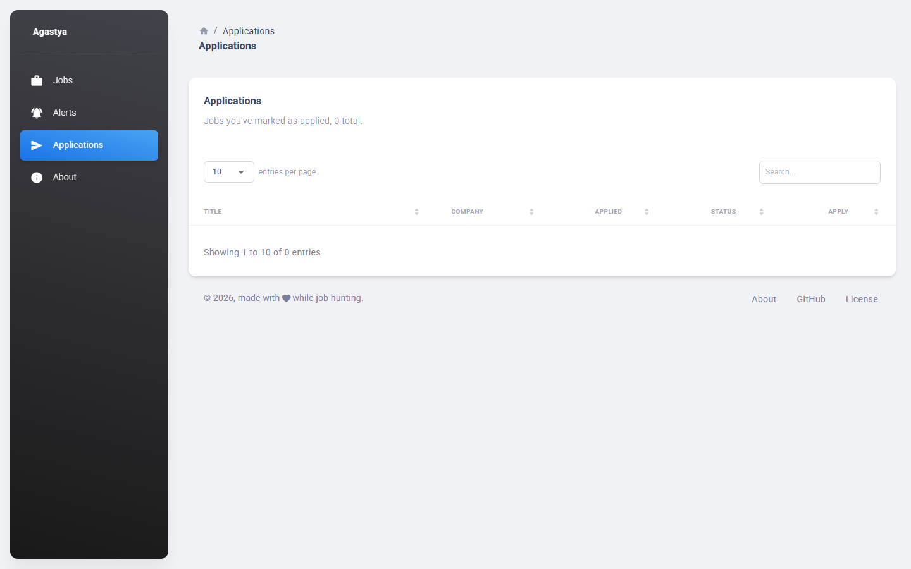
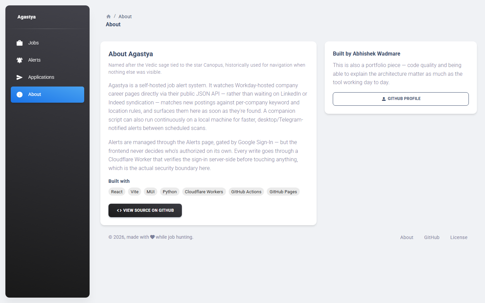

# Agastya

A self-hosted job alert system that monitors Workday-hosted company career
pages directly (rather than waiting for LinkedIn/Indeed syndication),
surfaces new postings on a public multi-page dashboard (Jobs / Companies /
Alerts / Admins / Applications / About), and sends desktop + Telegram
notifications.
Anyone can view the dashboard and even fill out the add-company/add-alert
forms, but actually adding, deleting, syncing, or triggering a scrape
requires signing in with Google as an admin or user - enforced
server-side, not just in the browser. A built-in **Admins** page lets the
owner grant others limited (user) or full (admin) access.

## Screenshots

| Jobs | Companies |
|---|---|
|  |  |

| Alerts | Applications |
|---|---|
|  |  |

| About |
|---|
|  |

## Architecture

```
scraper/   Python. Polls every company in companies.json's public
           Workday JSON API (paginated - fetches everything, not just
           the first page), writes ALL postings into
           frontend/public/data/jobs.json unfiltered, commits the
           change, then dispatches deploy.yml itself so GitHub Pages
           rebuilds with the new data (a plain push from this workflow
           doesn't trigger other workflows on its own - see "Known
           quirks" below). Runs via GitHub Actions cron (currently
           paused) or on demand via the Jobs page's "Fetch jobs now"
           button.

frontend/  React (Vite) + Material Dashboard React (MUI-based, Creative
           Tim), deployed to GitHub Pages. Multi-page - Jobs, Companies,
           Alerts, Admins, Applications, About - via HashRouter (no
           server-side routing needed on static hosting). Reads the JSON
           files and displays them. The Companies, Alerts, and Admins
           pages have "Sign in with Google" admin controls - but the
           frontend itself never decides who's allowed to write
           anything; it just calls the Worker and shows the result
           (role-based UI hiding is cosmetic only).

worker/    A Cloudflare Worker. Verifies the Google ID token it receives,
           resolves the token's email to a role - either the permanent
           bootstrap owner (ALLOWED_EMAIL, always role admin) or an entry
           in admins.json ("admin" or "user") - and only if that role is
           sufficient for the requested route does it write to the
           GitHub repo using a GitHub token stored as a Worker secret (or,
           for "Fetch jobs now", dispatch the scraper workflow via the
           GitHub Actions API). This is the actual security boundary.
           "admin" can do everything, including managing the admin/user
           list; "user" can manage alerts and applications only.

admin/     A local-only CLI, kept as an offline fallback. Uses a hashed
           password in a git-ignored token.txt. Useful if you want to
           make changes without going through the browser at all.
```

Nothing sensitive - no GitHub token, no password - is ever present in the
deployed frontend bundle. The Google client ID and Worker URL in
`frontend/src/config.js` are meant to be public.

**Companies vs. Alerts:** `companies.json` (which Workday career pages to
watch) is what actually drives the scraper. `alerts.json` still exists
and is still fully functional to edit, but nothing reads it anymore -
it's reserved for a future per-viewer keyword/location filtering
feature. Every posting from a watched company shows up on Jobs today,
unfiltered.

**Known quirks worth knowing before you debug them:**
- GitHub Actions has a built-in loop-prevention rule: a commit pushed
  using a workflow's own auto-generated token does not trigger other
  workflows, even if their `on.push.paths` would otherwise match.
  `scrape.yml` works around this by explicitly dispatching `deploy.yml`
  itself after a successful scrape - if you fork this and see new jobs
  in the repo but not on the live site, this is almost certainly why.
- The Google Identity Services script loads `async`/`defer`, so it may
  not be ready the instant a page mounts. The sign-in button polls for
  it (100ms interval, 10s timeout) rather than checking once, so it
  should always eventually appear - if it doesn't within ~10s, the
  script itself failed to load (network block, ad blocker, etc).

## 1. Google OAuth client (for Sign-In)

1. Go to [Google Cloud Console](https://console.cloud.google.com/) →
   APIs & Services → Credentials.
2. Create an OAuth 2.0 Client ID, type "Web application".
3. Under **Authorized JavaScript origins**, add your GitHub Pages URL,
   e.g. `https://<your-username>.github.io`.
4. Copy the client ID - you'll need it in two places (step 4 and step 6).

## 2. GitHub repo + a scoped token for the Worker

1. Push this project to a new GitHub repo.
2. Create a **fine-grained personal access token**
   (Settings → Developer settings → Fine-grained tokens) scoped to just
   this repo, with **Contents: read and write** AND **Actions: read and
   write** permissions. The second one is easy to miss but required -
   without it, the Jobs page's "Fetch jobs now" button (and the
   scraper's own post-scrape Pages-rebuild step) will fail with a
   permissions error.

## 3. Deploy the Cloudflare Worker

```bash
cd worker
npm install
npx wrangler login
```

Edit `worker/wrangler.toml`:
- `ALLOWED_EMAIL` - the permanent bootstrap admin, e.g. your own email.
  This account is always role `admin`, even if `admins.json` is missing
  or empty, so you can't lock yourself out.
- `GOOGLE_CLIENT_ID` - paste the client ID from step 1
- `GITHUB_OWNER` - your GitHub username
- `GITHUB_REPO` - your repo name

Then:

```bash
npx wrangler secret put GITHUB_TOKEN
# paste the fine-grained PAT from step 2 when prompted

npm run deploy
```

Wrangler will print your Worker's URL, something like
`https://agastya-admin.<your-subdomain>.workers.dev`.

## 4. Point the frontend at your Worker and Google client

Edit `frontend/src/config.js`:

```js
export const GOOGLE_CLIENT_ID = "<paste from step 1>";
export const WORKER_BASE_URL = "<paste your Worker URL from step 3>";
```

Also update the two hardcoded GitHub links in
`frontend/src/layouts/about/index.jsx` (repo and profile URLs) if
you're forking this rather than running it as-is.

Commit and push - this triggers `deploy.yml`, which builds and publishes
to GitHub Pages.

## 5. Enable GitHub Pages

**Settings → Pages → Build and deployment → Source: GitHub Actions.**

## 6. Find your target companies' Workday details

Not every company uses Workday - check by visiting their careers page. If
the URL looks like `https://<tenant>.wd1.myworkdayjobs.com/<site>/...`,
you're good. Note the `wd1` part - it's sometimes `wd3`, `wd5`, etc; the
Companies page's "paste a Workday URL" parser fills this in for you
automatically, so you shouldn't need to edit code for this.

## 7. Add your first company

Once deployed, visit your live site's **Companies** page. Anyone can see
the watched companies and fill out the add-company form, but submitting
requires clicking **Sign in with Google** (top-right) and signing in as
an admin (companies require the `admin` role, not just `user`). Once
added, every posting from that company shows up on the Jobs page -
unfiltered, no keyword/location matching yet (that's a deferred
per-viewer feature; the **Alerts** page still works if you want to use
it, it's just not wired into the scraper).

## 8. (Optional) Telegram notifications

1. Message [@BotFather](https://t.me/BotFather) on Telegram, run `/newbot`,
   copy the token it gives you.
2. Message [@userinfobot](https://t.me/userinfobot) to get your numeric
   chat ID.
3. In your repo: **Settings → Secrets and variables → Actions**, add:
   - `TELEGRAM_BOT_TOKEN`
   - `TELEGRAM_CHAT_ID`

## 9. Run the scraper

Either click **Fetch jobs now** on the live site's Jobs page (signed in
as an admin), or trigger it manually from GitHub: **Actions tab
→ Scrape jobs → Run workflow**. Both dispatch the same workflow. The
cron schedule is currently commented out in
`.github/workflows/scrape.yml` - uncomment it (and adjust the interval)
if you want it to run automatically again.

## Managing admins and users

Beyond the permanent bootstrap admin (`ALLOWED_EMAIL` in
`worker/wrangler.toml`), you can grant others access from the **Admins**
page - visible to everyone, but the add/remove controls only work when
signed in as an existing `admin`. Two roles:
- **admin** - full access: companies, alerts, applications, fetch-jobs,
  sync-jobs, and managing the admin/user list itself.
- **user** - can manage alerts and applications only; everything else is
  read-only.

The list lives in `frontend/public/data/admins.json`, written through
the Worker the same way as the other data files (a git-tracked, auditable
commit per change). There's no "edit role" action - change someone's role
by removing and re-adding them.

## Offline / local admin fallback

If you'd rather not go through the browser:

```bash
python admin/set_token.py          # run once, creates admin/token.txt (git-ignored)
python admin/admin_cli.py add-alert
python admin/admin_cli.py delete-alert --id <alert-id>   # requires the password
python admin/admin_cli.py mark-applied --job-id "<id>"
```

Then commit and push `frontend/public/data/` yourself.

## Local job watcher (desktop + Telegram notifications)

Runs continuously on your own machine instead of waiting on the 4-hour
GitHub Actions cron. Polls the same Workday endpoints on a configurable
interval (default 30 min, minimum 20), fires a desktop popup and/or
Telegram message for new postings, and writes results to a local JSON
file (default your Downloads folder) - it never commits anything back
to the repo.

The watched-company list and the initial "already seen" baseline are
always fetched fresh from the live repo on GitHub, so this stays in
sync with whatever you've configured on the Companies page without
needing a `git pull`.

```bash
cd scraper
pip install -r requirements.txt -r requirements-local.txt
cp .env.example .env   # edit as needed - interval, output path, Telegram creds
python local_watch.py
```

Leave it running in a terminal; stop with Ctrl+C.

To bring what the watcher finds into the live site, go to the **Alerts**
page (signed in) and use **Sync jobs from local watcher** to upload the
local file - it merges by job id via the Worker, so re-uploading the
same file is always safe.

## Local development

```bash
cd frontend
npm install
npm run dev
```

## Notes on scope

This deliberately does not scrape LinkedIn. LinkedIn's Terms of Service
prohibit automated scraping, and detection risks account suspension.
Workday's job search endpoint is a public, unauthenticated JSON API
designed to be consumed by the career site's own frontend, which is a
materially different situation.

## License

MIT - see [LICENSE](./LICENSE).
